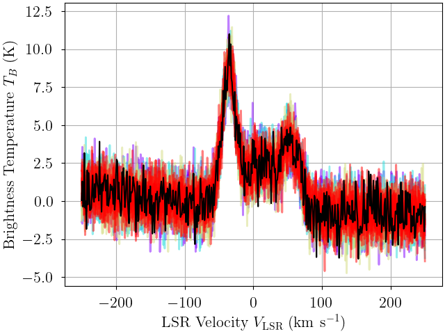
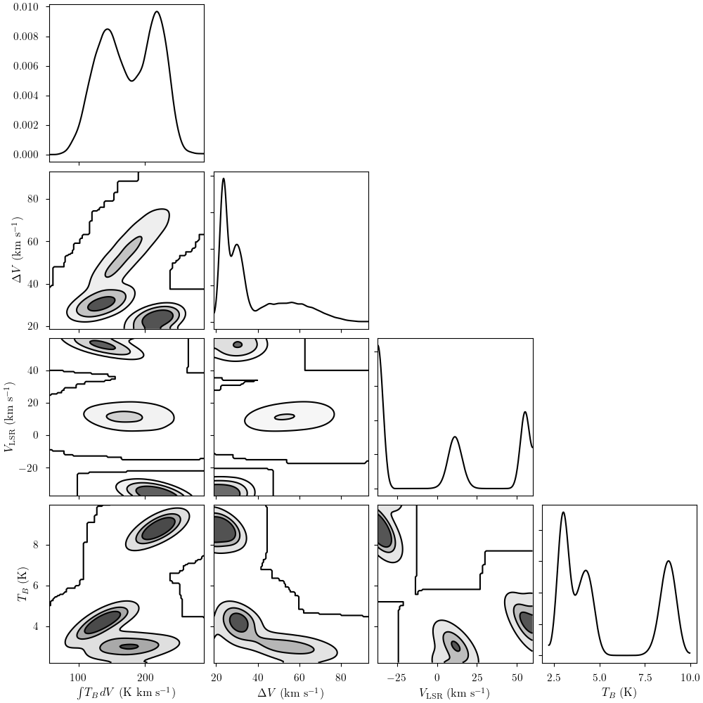

# bayes_spec <!-- omit in toc -->


[](https://codecov.io/github/tvwenger/bayes_spec)
[](https://bayes-spec.readthedocs.io/en/latest/?badge=latest)
[](https://joss.theoj.org/papers/ac05a353639c3268883cae19ca6a9cf9)

A Bayesian Spectral Line Modeling Framework for Astrophysics

`bayes_spec` is a framework for user-defined, cloud-based models of astrophysical systems (e.g., the interstellar medium) that enables spectral line simulation and statistical inference. Built in the [`pymc` probabilistic programming library](https://www.pymc.io/welcome.html), `bayes_spec` uses Monte Carlo Markov Chain techniques to fit user-defined models to data. The user-defined models can be a simple line profile (e.g., a Gaussian profile) or a complicated physical model. The models are "cloud-based", meaning there can be multiple "clouds" or "components" each with a unique set of the model parameters. `bayes_spec` includes algorithms to estimate the optimal number of components in a given dataset.

Read below to get started, and check out the tutorials and guides here: https://bayes-spec.readthedocs.io.

- [Installation](#installation)
  - [Basic Installation](#basic-installation)
  - [Development Installation](#development-installation)
- [Quick Start](#quick-start)
- [Usage](#usage)
  - [Data Format](#data-format)
  - [Model Specification](#model-specification)
- [Algorithms](#algorithms)
  - [Posterior Sampling: Variational Inference](#posterior-sampling-variational-inference)
  - [Posterior Sampling: MCMC](#posterior-sampling-mcmc)
  - [Posterior Sampling: SMC](#posterior-sampling-smc)
  - [Posterior Clustering: Gaussian Mixture Models](#posterior-clustering-gaussian-mixture-models)
  - [Optimization](#optimization)
- [Models](#models)
  - [`bayes_spec.models.GaussModel`](#bayes_specmodelsgaussmodel)
  - [`bayes_spec.models.GaussNoiseModel`](#bayes_specmodelsgaussnoisemodel)
  - [`ordered_velocity`](#ordered_velocity)
- [Syntax \& Examples](#syntax--examples)
- [Feedback, Issues, and Contributing](#feedback-issues-and-contributing)
- [License and Copyright](#license-and-copyright)


# Installation

## Basic Installation

Install with `pip` in a `conda` virtual environment:
```
conda create --name bayes_spec -c conda-forge pymc pip
conda activate bayes_spec
# Due to a bug in arviz, this fork is temporarily necessary
# See: https://github.com/arviz-devs/arviz/issues/2437
pip install git+https://github.com/tvwenger/arviz.git@plot_pair_reference_labels
pip install bayes_spec
```

## Development Installation

Alternatively, download and unpack the [latest release](https://github.com/tvwenger/bayes_spec/releases/latest), or [fork the repository](https://docs.github.com/en/pull-requests/collaborating-with-pull-requests/working-with-forks/fork-a-repo) and contribute to the development of `bayes_spec`!

Install in a `conda` virtual environment:
```
cd /path/to/bayes_spec
conda env create -f environment.yml
# or, if you would like to use CUDA (nvidia GPU) samplers:
# conda env create -f environment-cuda.yml
conda activate bayes_spec-dev
pip install -e .
```

# Quick Start

Here we demonstrate how to use `bayes_spec` to fit a simple Gaussian line profile model to a synthetic spectrum. For more details, see the [Usage](#usage) section as well as the [documentation and tutorials](https://bayes-spec.readthedocs.io).

```python
# Generate data structure
import numpy as np
from bayes_spec import SpecData

velocity_axis = np.linspace(-250.0, 250.0, 501) # km s-1
noise = 1.0 # K
brightness_data = noise * np.random.randn(len(velocity_axis)) # K
observation = SpecData(velocity_axis, brightness_data, noise,
                       ylabel=r"Brightness Temperature $T_B$ (K)",
                       xlabel=r"LSR Velocity $V_{\rm LSR}$ (km s$^{-1})$")
data = {"observation": observation}

# Prepare a three cloud GaussLine model with polynomial baseline degree = 2
from bayes_spec.models import GaussModel

model = GaussModel(data, n_clouds=3, baseline_degree=2)
model.add_priors()
model.add_likelihood()

# Evaluate the model for a given set of parameters to generate a synthetic "observation"
sim_brightness = model.model.observation.eval({
    "fwhm": [25.0, 40.0, 35.0], # FWHM line width (km/s)
    "line_area": [250.0, 125.0, 175.0], # line area (K km/s)
    "velocity": [-35.0, 10.0, 55.0], # velocity (km/s)
    "baseline_observation_norm": [-0.5, -2.0, 3.0], # normalized baseline coefficients
})

# Pack data structure with synthetic "observation"
observation = SpecData(velocity_axis, sim_brightness, noise,
                       ylabel=r"Brightness Temperature $T_B$ (K)",
                       xlabel=r"LSR Velocity $V_{\rm LSR}$ (km s$^{-1})$")
data = {"observation": observation}

# Initialize the model with the synthetic observation
model = GaussModel(data, n_clouds=3, baseline_degree=2)
model.add_priors()
model.add_likelihood()

# Draw posterior samples via MCMC
model.sample()

# Solve labeling degeneracy
model.solve()

# Draw posterior predictive samples
from bayes_spec.plots import plot_predictive

posterior = model.sample_posterior_predictive(thin=100)
axes = plot_predictive(model.data, posterior.posterior_predictive)
axes.ravel()[0].figure.show()

# visualize posterior distribution
from bayes_spec.plots import plot_pair

axes = plot_pair(model.trace.solution_0, model.cloud_deterministics, labeller=model.labeller)
axes.ravel()[0].figure.show()

# get posterior summary statistics
import arviz as az

print(az.summary(model.trace.solution_0))
```



Posterior predictive samples for a three-cloud `GaussLine` model fit to a synthetic spectrum. The black line represents the synthetic spectrum, and each colored line is one posterior predictive sample.



Projections of the posterior distribution for a three-cloud `GaussLine` model fit to a synthetic spectrum. The free model parameters are the integrated line area, $\int T_B dV$, the full-width at half-maximum line width, $\Delta V$, and the line-center velocity, $V_{\rm LSR}$. The line amplitude, $T_B$, is a derived quantity. The three posterior modes correspond to the three clouds in this model.

# Usage

`bayes_spec` assumes that the source of spectral line emission can be decomposed into a series of "clouds" or "components", each of which are defined by a *unique* set of model parameters. For a simple line profile model (like a Gaussian profile), these parameters might be the Gaussian amplitude, center velocity, and line width. For a more complicated model, they might be the optical depth, excitation temperature, and velocity of the cloud. `bayes_spec` also supports hyper-parameters: parameters that influence both non-cloud based features in the data (e.g., spectral baseline structure) as well as overall cloud properties (e.g., a property assumed shared among all clouds) or physical relationships (e.g., an empirical scaling law).

*Users are responsible for defining and testing their models.* Here we briefly describe how to do this, but see [Syntax \& Examples](#syntax--examples) for some practical demonstrations. Additional tips and tricks can be found in the documentation: https://bayes-spec.readthedocs.io/en/stable/tips.html

Users must specify the following:

1. The data
2. Model parameters and hyper-parameters
3. The parameter and hyper-parameter prior distributions
4. Derived quantities (called "deterministics") that should be saved (e.g., for inference)
5. The relationship between the model parameters and spectral observations (i.e., the likelihood)

## Data Format

Data must be packaged within a `bayes_spec.SpecData` object. `SpecData` takes three arguments: the spectral axis (i.e., frequency, velocity), the brightness data (e.g., brightness temperature, flux density), and the noise (in the same units as the brightness data). The noise can either be a scalar value, in which case it is assumed constant across the spectrum, or an array of the same length as the brightness_data.

```python
from bayes_spec import SpecData

spec = SpecData(spectral_axis, brightness_data, noise, xlabel="Velocity", ylabel="Brightness Temperature")
```

The spectral and brightness data are accessed via `spec.spectral` and `spec.brightness`, respectively. The noise is accessed via `spec.noise`.

The data are passed to a `bayes_spec` model in a dictionary, which allows multiple spectra to be included in a single model. For example, if a model is constrained by both an emission-line spectrum and an absorption-line spectrum, then this dictionary might look something like this:

```python
emission = SpecData(emission_spec_axis, emission_data, emission_noise, xlabel="Velocity", ylabel="Brightness Temperature")
absorption = SpecData(absorption_spec_axis, absorption_data, absorption_noise, xlabel="Velocity", ylabel="Optical Depth")

data = {"emission": emission, "absorption": absorption}
```

The keys of this data dictionary (`"emission"` and `"absorption"` in this case) are important, you must remember them and use the same keys in your model definition. 

Internally, `SpecData` normalizes both the spectral axis and the data. Generally, this is only relevant for the polynomial baseline model, which is fit to the normalized data.

## Model Specification

Model specification is made though a class that extends the `bayes_spec.BaseModel` base model class definition. This class must include three methods: `__init__`, which initializes the model, and `add_priors`, which adds the priors to the model, and `add_likelihood`, which adds the likelihood to the model. These priors and likelihood are specified following the usual `pymc` syntax. [See the definition of `GaussModel` for an example.](https://github.com/tvwenger/bayes_spec/blob/main/bayes_spec/models/gauss_model.py) Alternatively, the class can extend an existing `bayes_spec` model, which is convenient for similar models with, for example, added complexity. [See the definition of `GaussNoiseModel`, which extends `GaussLine`.](https://github.com/tvwenger/bayes_spec/blob/main/bayes_spec/models/gauss_noise_model.py)

A step-by-step guide for creating `bayes_spec` models can be found in the documentation: https://bayes-spec.readthedocs.io/en/stable/models.html

# Algorithms

## Posterior Sampling: Variational Inference

`bayes_spec` can sample from an approximation of model posterior distribution using [variational inference (VI)](https://www.pymc.io/projects/examples/en/latest/variational_inference/variational_api_quickstart.html). The benefit of VI is that it is fast, but the downside is that it often fails to capture complex posterior topologies. We recommend only using VI for quick model tests or MCMC initialization. Draw posterior samples using VI via `model.fit()`.

## Posterior Sampling: MCMC

`bayes_spec` can also use MCMC to sample the posterior distribution. MCMC sampling tends to be much slower but also more accurate. Draw posterior samples using MCMC via `model.sample()`. Since `bayes_spec` uses `pymc` for sampling, several `pymc` samplers are available, including GPU samplers (see ["other samplers" example notebook](https://bayes-spec.readthedocs.io/en/stable/notebooks/other_samplers.html)).

## Posterior Sampling: SMC

Finally, `bayes_spec` implements Sequential Monte Carlo (SMC) sampling via `model.sample_smc()`. SMC can significantly improve performance for degenerate models with multi-modal posterior distributions, although it struggles with high dimensional models and models that suffer from a strong labeling degeneracy (see ["other samplers" example notebook](https://bayes-spec.readthedocs.io/en/stable/notebooks/other_samplers.html)).

## Posterior Clustering: Gaussian Mixture Models

Assuming that we have drawn posterior samples via MCMC or SMC using multiple independent Markov chains, then it is possible that each chain disagrees on the order of clouds. This is known as the labeling degeneracy. For some models (e.g., optically thin radiative transfer), the order of clouds along the line-of-sight is arbitrary so each chain may converge to a different label order.

It is also possible that the model solution is degenerate, the posterior distribution is strongly multi-modal, and each chain converges to different, unique solutions.

`bayes_spec` uses Gaussian Mixture Models (GMMs) to break the labeling degeneracy and identify unique solutions. After sampling, execute `model.solve()` to fit a GMM to the posterior samples of each chain individually. Unique solutions are identified by discrepant GMM fits, and we break the labeling degeneracy by adopting the most common cloud order amongst chains. The user defines which parameters are used for the GMM clustering.

## Optimization

`bayes_spec` can optimize the number of clouds in addition to the other model parameters. The `Optimize` class will use VI, MCMC, and/or SMC to estimate the preferred number of clouds.

# Models

`bayes_spec` provides two basic models for convenience. 

## `bayes_spec.models.GaussModel`

`GaussModel` is a Gaussian line profile model. The model assumes that the emission of each cloud is a Gaussian-shaped spectral line. The `SpecData` key must be `"observation"`. The following diagram demonstrates the relationship between the free parameters (empty ellipses), deterministic quantities (rectangles), model predictions (filled ellipses), and observations (filled, round rectangles). Many of the parameters are internally normalized (and thus have names like `_norm`). The subsequent tables describe the model parameters in more detail.


| Cloud Parameter<br>`variable` | Parameter                                   | Units      | Prior, where<br>($p_0, p_1, \dots$) = `prior_{variable}`         | Default<br>`prior_{variable}` |
| :---------------------------- | :------------------------------------------ | :--------- | :--------------------------------------------------------------- | :---------------------------- |
| `line_area`                   | Integrated line area                        | `K km s-1` | $\int T_{B, \rm H} dV \sim {\rm Gamma}(\alpha=2.0, \beta=1.0/p)$ | `100.0`                       |
| `fwhm`                        | FWHM line width                             | `km s-1`   | $\Delta V_{\rm H} \sim {\rm Gamma}(\alpha=3.0, \beta=2.0/p)$     | `20.0`                        |  |
| `velocity`                    | Center velocity                             | `km s-1`   | $V_{\rm LSR, H} \sim {\rm Normal}(\mu=p_0, \sigma=p_1)$          | `[0.0, 25.0]`                 |
| `baseline_coeffs`             | Normalized polynomial baseline coefficients | ``         | $\beta_i \sim {\rm Normal}(\mu=0.0, \sigma=p_i)$                 | `[1.0]*(baseline_degree + 1)` |

## `bayes_spec.models.GaussNoiseModel`

`GaussNoiseModel` extends `GaussModel` to add an additional free parameter: the spectral rms noise. The `SpecData` key must be `"observation"`.


| Hyper Parameter<br>`variable` | Parameter          | Units | Prior, where<br>($p_0, p_1, \dots$) = `prior_{variable}` | Default<br>`prior_{variable}` |
| :---------------------------- | :----------------- | :---- | :------------------------------------------------------- | :---------------------------- |
| `rms`                         | Spectral rms noise | `K`   | ${\rm rms} \sim {\rm HalfNormal}(\sigma=p)$              | `1.0`                         |

## `ordered_velocity`

An additional parameter to `set_priors` for these models is `ordered_velocity`. By default, this parameter is `False`, in which case the order of the clouds is arbitrary. Sampling from these models can be challenging due to the labeling degeneracy: if the order of clouds does not matter (i.e., the emission is optically thin), then each Markov chain could decide on a different, equally-valid order of clouds.

If we assume that the emission is optically thin (and thus the order of clouds really is arbitrary), then we can set `ordered_velocity=True`, in which case the order of clouds is restricted to be increasing with velocity. This assumption can *drastically* improve sampling efficiency. When `ordered_velocity=True`, the `velocity` prior is defined differently:

| Cloud Parameter<br>`variable` | Parameter       | Units    | Prior, where<br>($p_0, p_1, \dots$) = `prior_{variable}`                 | Default<br>`prior_{variable}` |
| :---------------------------- | :-------------- | :------- | :----------------------------------------------------------------------- | :---------------------------- |
| `velocity`                    | Center velocity | `km s-1` | $V_i \sim p_0 + \sum_0^{i-1} V_i + {\rm Gamma}(\alpha=2, \beta=1.0/p_1)$ | `[0.0, 25.0]`                 |

# Syntax & Examples

See the various tutorial notebooks under [docs/source/notebooks](https://github.com/tvwenger/bayes_spec/tree/main/docs/source/notebooks). Tutorials and the full API are available here: https://bayes-spec.readthedocs.io.

# Feedback, Issues, and Contributing

If you have questions about `bayes_spec`, then please consider starting a [discussion on GitHub](https://github.com/tvwenger/bayes_spec/discussions).

Should you find any issues or encounter any problems with `bayes_spec`, then please submit an [issue on GitHub](https://github.com/tvwenger/bayes_spec/issues).

Anyone is welcome to contribute to the development of `bayes_spec` via [GitHub](https://github.com/tvwenger/bayes_spec). Please consider submitting a pull request for any bug fixes or new features!

# License and Copyright

Copyright(C) 2024 by
Trey V. Wenger; tvwenger@gmail.com
This code is licensed under MIT license (see LICENSE for details)
